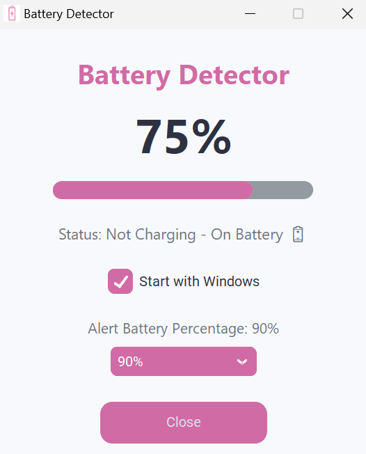
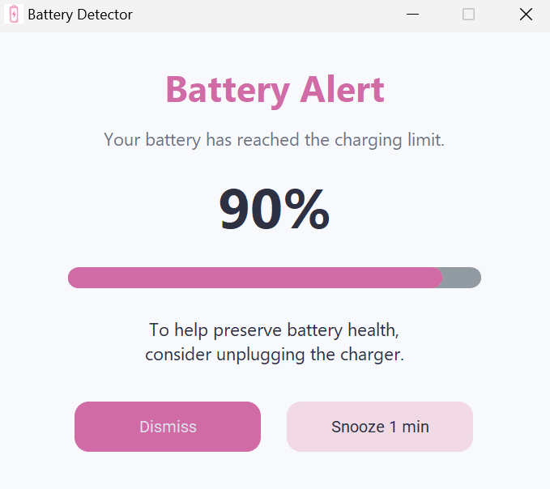

# Battery Detector 
*A lightweight Windows application that helps preserve battery health by notifying users when their laptop reaches a configurable charging threshold.*

## 📖 Problem
This project was more of a solution to a problem that I faced daily.

A few days ago, I had to replace my laptop's battery a second time because its health had deteriorated over time. My laptop doesn't have an indicator that tells me when it is fully charged, nor does it have a built-in feature to stop charging once the battery reaches a certain percentage.

**Because of this, I often forgot to unplug the charger after plugging it in. The laptop would continue charging all the way to 100% and stay plugged in for long periods, which isn't ideal for battery health.**

After this happened one too many times, I decided to build something that would solve the problem for me.

## 💡 Solution
The solution was actually quite simple.

I needed a lightweight application that would quietly run in the background and notify me whenever my laptop reached a battery percentage that I chose (80%, 85%, 90%, 95% or 100%).

That's exactly what Battery Detector does.

**Built in Python, it lives in the system tray, monitors your battery in the background, and reminds you when it's time to unplug the charger. It also lets you customize the alert threshold and can automatically start whenever Windows boots.**

## 🖼️ Application Preview

### *Dashboard*

  

The dashboard provides an overview of the current battery status and application settings.

- Displays the current battery percentage.
- Shows whether the laptop is charging or running on battery.
- Allows the user to configure the battery alert threshold.
- Provides the option to automatically start the application when Windows boots.

### *Notification*

  

The notification appears when the selected battery threshold is reached.

- Displays the current battery percentage.
- Plays a notification sound.
- Reminds the user to unplug the charger.
- Allows the user to either dismiss or snooze the reminder.

## ⚙️ Features
- 🔋 Live battery percentage dashboard
- 🔔 Battery notification at a user-selected threshold
- ⚙️ Configurable alert threshold (80%, 85%, 90%, 95%, 100%)
- 🚀 Optional "Start with Windows" support
- 📌 Runs quietly from the Windows system tray
- 💾 Saves preferences automatically
- 🎨 Clean desktop interface built with CustomTkinter

## 🛠️ Libraries and Tools Used
- CustomTkinter
- psutil
- pystray
- Pillow (PIL)
- pywin32
- winsound
- threading
- json
- PyInstaller

## 📝 Notes
Because this application is built using PyInstaller and is not code-signed, Windows Defender or some antivirus software may initially flag the executable or display a SmartScreen warning.

The project is completely open source, and the full source code is available in this repository for anyone to inspect. The executable is built directly from this code, so you can verify exactly what the application does before running it.
